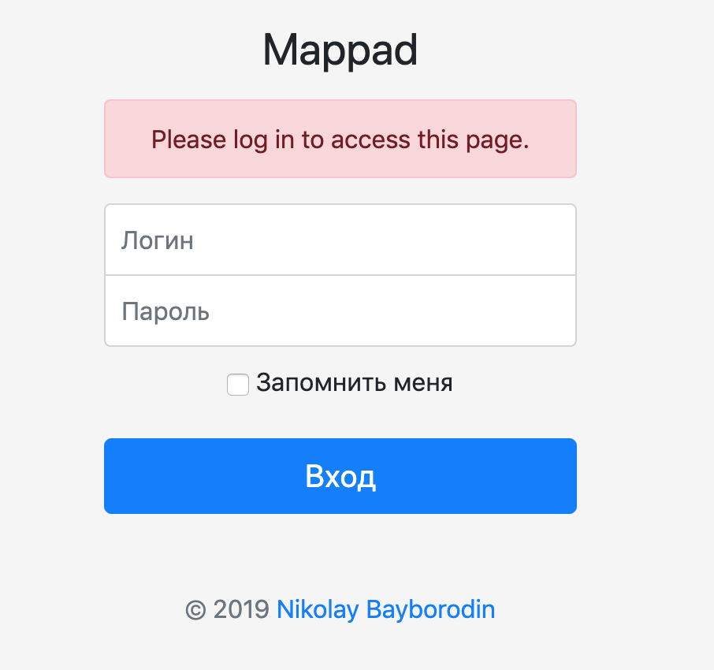

# mappad.ru
Сервис хранения GPS треков
Позволяет зарегистрированным пользователям загружать GPS треки в различных форматах, сохранять их в личном кабинете, просматривать на карте, а также - видеть основные характеристики трека.
Сервис имеет социальную составляющую:
* Делиться GPS треками с другими пользователями (приватные и публичные GPS треки)
* Подписываться на треки других пользователей
* Оставлять коментарии к GPS треками других пользователей

В проекте используется интеграция со следующими внешними сервисами:
* OpenStreetMap
* Mapbox

## Интерфейс приложения

